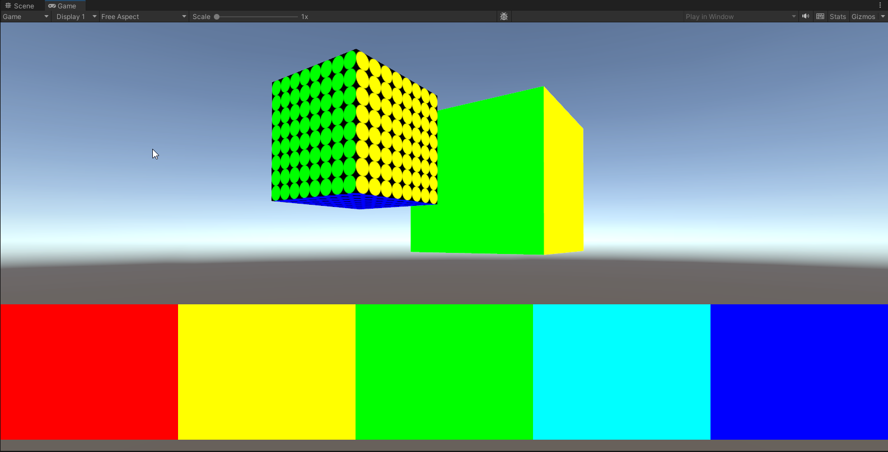
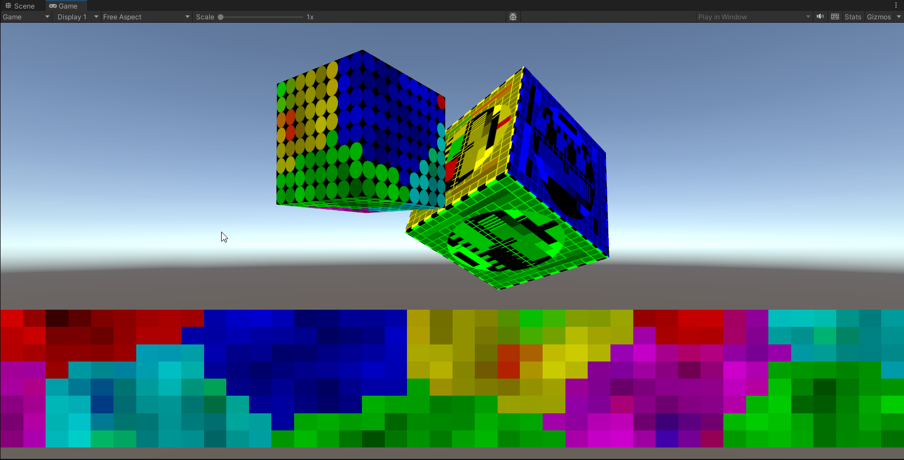
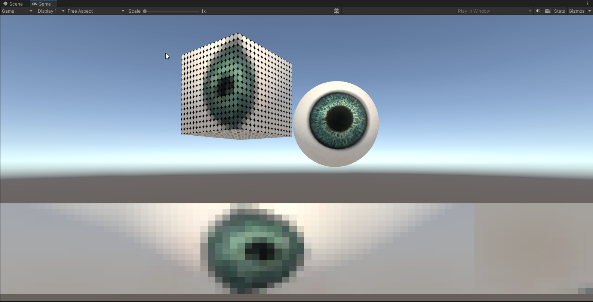

# WLED-Feed

## Intro
This is a project in which images of a 3D scene are captured and sent over an UDP connection to be displayed on a WLED installation.

## Effects

### Eye to cube
At this time there's one effect, _Eye to cube_ this effect captures the 3D scene like a panorama camera and stores it in 5 square images.  
It then sends it over an UDP connection to a WLED installation as RGB values, 1 byte per color, encoding 0-255 values.

#### Scenes
-   Assets/Effects/Eye to cube/Test cube simple.unity : Stationary cube with primary colors, can be used for debugging
  
- Assets/Effects/Eye to cube/Test cube fancy.unity : Textured spinning cube
  
- Assets/Effects/Eye to cube/Eye to cube.unity : Rotating eye ball
  

#### Notes
In each scene there is a GameObject named _- Scrips -_, that's where parameters of the main functionality can be changed, like :

- Network parameters
- LED matrix resolution
